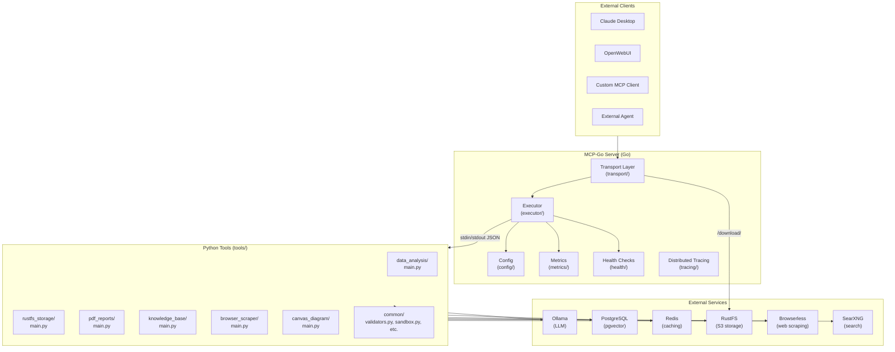

# MCP-Go Architecture Documentation

**Project:** MCP-Go Orchestrator Server  
**Description:** Model Context Protocol server that orchestrates Python tools via subprocess execution with S3-compatible storage backend  
**Stack:** Go 1.23+ | Python 3.11+ | Docker | PostgreSQL | Redis | RustFS

---

## Overview

MCP-Go is an MCP (Model Context Protocol) server implementation that bridges AI clients (Claude Desktop, OpenWebUI, custom clients) with a collection of Python-based tools. It provides:

- **MCP Protocol Support**: Streamable HTTP (2025) + SSE (2024) transports
- **Tool Orchestration**: Execute Python tools as subprocesses with timeout/caching
- **Storage Backend**: S3-compatible object storage (RustFS) for file operations
- **Observability**: Prometheus metrics, health checks, structured logging
- **Security**: SSRF protection, path traversal prevention, rate limiting

---

## Component Architecture



---

## Directory Structure

```
mcp-go/
├── cmd/server/              # Entry point
├── internal/
│   ├── config/             # YAML config loading and validation
│   ├── executor/           # Tool subprocess execution, LLM client
│   ├── mcp/                # MCP types (SubprocessRequest/Response)
│   ├── metrics/            # Prometheus metrics definitions
│   ├── health/             # Health check implementations
│   ├── prompts/            # MCP prompts handler
│   ├── tracing/             # Distributed tracing (NoOp + interface)
│   └── transport/          # HTTP/SSE handlers, middleware
├── tools/                  # Python tool implementations
│   ├── common/             # Shared utilities (validators, sandbox, etc.)
│   ├── data_analysis/      # Pandas code execution tool
│   ├── rustfs_storage/      # S3 operations (upload/download/list)
│   ├── pdf_reports/         # PDF generation with Jinja2/WeasyPrint
│   ├── knowledge_base/     # Vector search with pgvector
│   ├── browser_scraper/     # Browser automation (Playwright)
│   ├── web_scraper/         # HTTP-based web scraping
│   ├── web_search/          # Web search integration
│   ├── searxng_search/       # Privacy-respecting search
│   ├── canvas_diagram/      # Mermaid diagram generation
│   └── ...                  # Additional tools
├── configs/                 # YAML configuration files
├── templates/               # Jinja2 templates (PDF reports, etc.)
├── deployments/             # Docker Compose and Dockerfile
└── tests/                   # Test suites
```

---

## Internal Packages

### `internal/config/`

**Responsibility:** Configuration loading from YAML files with environment variable expansion.

**Key Types:**
- `Config` - Root configuration structure
- `ServerConfig` - HTTP server settings (port, rate limiting, CORS)
- `ExecutionConfig` - Tool execution settings (timeout, working dir, env vars)
- `ToolConfig` - Individual tool definitions

**Key Functions:**
- `Load(path string) (*Config, error)` - Load and parse config file
- `LoadWithDefaults() (*Config, error)` - Load with environment variable expansion
- `Validate(cfg *Config) error` - Validate configuration integrity

**Dependencies:** `gopkg.in/yaml.v3`

---

### `internal/executor/`

**Responsibility:** Tool execution as subprocesses, LLM client with connection pooling.

**Key Types:**
- `Executor` - Manages tool execution lifecycle
- `ExecuteResult` - Result wrapper with content and error
- `LLMClient` - HTTP client for LLM backends (Ollama-compatible)

**Key Functions:**
- `New(cfg *config.Config) *Executor` - Create executor with no-op tracing
- `NewWithTracer(cfg *config.Config, tracer *tracing.Tracer) *Executor` - Create with custom tracer
- `Execute(ctx context.Context, toolName string, arguments map[string]interface{}) (*ExecuteResult, error)` - Execute a tool
- `NewLLMClient(endpoint, model string, timeout time.Duration) *LLMClient` - Create LLM client
- `Call(ctx context.Context, prompt string) (string, error)` - Call LLM with default model

**Protocol:** Tools communicate via JSON over stdin/stdout:
```json
// Server → Tool (stdin)
{"request_id": "uuid", "tool_name": "tool", "arguments": {...}, "context": {...}}

// Tool → Server (stdout)
{"success": true, "request_id": "uuid", "content": [...], "structured_content": {...}}

// Streaming (optional)
__CHUNK__:{"type": "status", "data": {"message": "..."}}
__RESULT__:{"success": true, ...}
```

**Dependencies:** `github.com/google/uuid`, `github.com/sudebaker/mcp-go/internal/config`, `github.com/sudebaker/mcp-go/internal/tracing`

---

### `internal/transport/`

**Responsibility:** HTTP transport layer for MCP protocol, middleware chain.

**Key Types:**
- `MCPServer` - Main HTTP server with all endpoints registered
- `DownloadHandler` - File download proxy (local + RustFS)
- `RateLimiter` - Token bucket rate limiting per client IP

**Key Functions:**
- `NewMCPServer(mcpServer *server.MCPServer, cfg MCPConfig) *MCPServer` - Create configured server
- `Start() error` - Start HTTP server (blocking)
- `Shutdown(ctx context.Context) error` - Graceful shutdown
- `NewDownloadHandler(expiryHours int) *DownloadHandler` - Create download handler
- `NewRateLimiter(rps float64, burst int) *RateLimiter` - Create rate limiter

**Endpoints:**
| Path | Method | Description |
|------|--------|-------------|
| `/` | GET | Server info |
| `/health` | GET | Basic health check |
| `/health/detailed` | GET | Component health status |
| `/metrics` | GET | Prometheus metrics |
| `/openapi.json` | GET | OpenAPI spec |
| `/mcp` | GET/POST | MCP Streamable HTTP |
| `/sse` | GET | MCP SSE endpoint |
| `/message` | POST | MCP SSE message endpoint |
| `/download/local/{filename}` | GET | Local file download |
| `/download/rustfs/{bucket}/{object}` | GET | RustFS presigned URL redirect |

**Middleware Chain:** CORS → Rate Limit → Tracing → Logging → MCP Handler

**Dependencies:** `github.com/mark3labs/mcp-go`, `github.com/aws/aws-sdk-go-v2`, `github.com/prometheus/client_golang`

---

### `internal/mcp/`

**Responsibility:** MCP protocol type definitions.

**Key Types:**
- `SubprocessRequest` - JSON sent to Python tools
- `SubprocessResponse` - JSON received from Python tools
- `ContentItem` - MCP content item (text, image, resource)
- `SubprocessError` - Error structure with code and message

---

### `internal/health/`

**Responsibility:** Health check implementations for external dependencies.

**Key Types:**
- `HealthStatus` - Enum: healthy, degraded, unhealthy
- `CheckResult` - Individual check result with timing
- `Checker` - Runs all configured health checks

**Checks Performed:**
1. **Redis** - Ping with 2s timeout
2. **PostgreSQL** - Ping with 2s timeout
3. **Config** - Verify tools are defined
4. **Memory** - Go runtime metrics (healthy < 250MB, degraded < 500MB)

**Key Functions:**
- `NewChecker(cfg *config.Config, redisClient *redis.Client, db *sql.DB) *Checker` - Create checker
- `RunAllChecks(ctx context.Context) []CheckResult` - Execute all checks
- `GetOverallStatus(results []CheckResult) HealthStatus` - Aggregate status
- `GetHealthMetrics() map[string]float64` - Runtime metrics for Prometheus

---

### `internal/metrics/`

**Responsibility:** Prometheus metrics definitions and export.

**Metrics Exposed:**
- `mcp_requests_total{method, status}` - Total HTTP requests
- `mcp_request_duration_seconds{method}` - Request latency histogram
- `mcp_tool_executions_total{tool_name, status}` - Tool execution count
- `mcp_tool_execution_duration_seconds{tool_name}` - Tool execution time
- `mcp_llm_requests_total{status}` - LLM API calls
- `mcp_llm_request_duration_seconds{provider}` - LLM API latency
- `mcp_rate_limit_hits_total` - Rate limit rejections
- `mcp_health_*` - Health check metrics

---

### `internal/tracing/`

**Responsibility:** Distributed tracing interface (NoOp implementation + interface for external tracers).

**Key Types:**
- `Tracer` - Interface with StartSpan method
- `Span` - Span with attributes and error recording

**NoOp Tracer:** Used when tracing is not configured.

---

## Python Tools

### Protocol

All Python tools follow a JSON stdin/stdout protocol:

```python
# Read request from stdin
import sys, json
request = json.loads(sys.stdin.read())

# Write response to stdout
response = {"success": True, "request_id": request["request_id"], "content": [...]}
print(json.dumps(response))
```

### `tools/common/`

**validators.py** - Security utilities:
- `is_internal_url(url: str) -> bool` - SSRF protection (blocks private IPs, cloud metadata)
- `validate_file_path(file_path, allowed_dir) -> Path` - Path traversal prevention
- `sanitize_filename(filename, max_length) -> str` - Remove dangerous characters

**sandbox.py** - Docker-based isolation:
- `DockerSandboxedExecutor` - Execute code in ephemeral containers
- `SandboxConfig` - Resource limits (memory, CPU, PID, network)
- `execute_in_sandbox(code, input_data)` - Run code with sandbox isolation

**doc_extractor.py** - Document parsing:
- `download_file(url) -> io.BytesIO` - Download with SSRF validation
- `extract_text_from_pdf(buffer) -> ExtractionResult` - PDF text extraction
- `validate_url_for_download(url) -> tuple[bool, str]` - SSRF validation

**llm_cache.py** - Redis-based LLM response caching:
- `LLMCache.get(prompt, model) -> Optional[str]` - Get cached response
- `LLMCache.set(prompt, model, response)` - Cache response with TTL

---

### `tools/data_analysis/`

**Purpose:** Execute Python/Pandas code on Excel/CSV data with LLM-generated code.

**Key Functions:**
- `main()` - Entry point, reads request from stdin, writes response to stdout
- `generate_code(llm_api_url, llm_model, question, file_info)` - Generate Pandas code via LLM
- `execute_code_in_sandbox(code, df)` - Execute in Docker sandbox with resource limits

**Features:**
- Streaming progress via `__CHUNK__:`
- Docker sandbox isolation (memory, CPU, PID limits)
- Fallback to direct exec if Docker unavailable
- Base64-encoded image output for charts

---

### `tools/rustfs_storage/`

**Purpose:** S3-compatible object storage operations.

**Key Functions:**
- `get_rustfs_client() -> Optional[Minio]` - Create MinIO client from env vars
- `upload_to_rustfs(file_path, bucket) -> dict` - Upload with presigned URL
- `download_from_rustfs(bucket, object, dest_path)` - Download to local path
- `list_objects(bucket, prefix) -> list` - List objects with prefix filter

**Operations:** upload, download, list, search, delete, stat

**Environment Variables:**
- `RUSTFS_ENDPOINT` - Internal endpoint (e.g., `http://rustfs:9000`)
- `RUSTFS_PUBLIC_URL` - Public URL for external agents
- `RUSTFS_ACCESS_KEY_ID`, `RUSTFS_SECRET_ACCESS_KEY` - Credentials
- `S3_BUCKET_NAME` - Default bucket (default: `default`)
- `RUSTFS_PRESIGNED_TTL_SECONDS` - Presigned URL expiry (default: 3600)

---

### `tools/pdf_reports/`

**Purpose:** Generate PDF reports from structured data using Jinja2 templates.

**Report Types:** incident, meeting, audit, executive_summary, formal_report, corporate_email, llm_response

**Key Functions:**
- `render_incident_report(data, env) -> str` - Render incident template
- `generate_pdf(html_content, output_path, css_path)` - Convert HTML to PDF via WeasyPrint
- `upload_to_rustfs(file_path, bucket) -> dict` - Upload to RustFS
- `main()` - Entry point with template rendering and upload

**Features:**
- Jinja2 sandboxed templates (prevents SSTI)
- CSS styling via styles.css
- Presigned URL generation for downloads
- Base64 PDF output in response

---

### `tools/knowledge_base/`

**Purpose:** Vector-based knowledge retrieval with pgvector.

**Key Functions:**
- `ensure_schema(conn)` - Create tables if not exist
- `add_document(file_path, collection, metadata)` - Add document with embedding
- `search(query, collection, top_k) -> list` - Semantic similarity search

**Schema:**
```sql
CREATE TABLE kb_documents (...);
CREATE TABLE kb_chunks (...) WITH vectors;
CREATE INDEX ON kb_chunks USING ivfflat (embedding vector_cosine_ops);
```

---

### `tools/browser_scraper/`

**Purpose:** Browser automation for JavaScript-heavy websites.

**Key Functions:**
- `scrape_url(url, selectors, wait_for)` - Scrape with Playwright
- `get_page_content(url)` - Simple HTTP fetch with content sanitization

**Features:**
- SSRF protection via validators
- Content sanitization (prompt injection prevention)
- Markdown output for LLM consumption

---

## External Dependencies

### RustFS (S3-Compatible Storage)

RustFS provides object storage with presigned URLs. It's accessed internally by Python tools and the download handler.

**Presigned URL Flow:**
1. Tool uploads file to RustFS using internal endpoint
2. Tool generates presigned URL for download
3. URL is returned to client via MCP response
4. Client downloads directly from RustFS

**Two URL Architecture:**
- `RUSTFS_ENDPOINT` - For MCP server → RustFS communication (internal)
- `RUSTFS_PUBLIC_URL` - For client → RustFS direct download (external)

---

## Security

### SSRF Protection (`tools/common/validators.py`)

Blocks access to:
- Loopback addresses (127.x, ::1, localhost)
- RFC-1918 private ranges (10.x, 172.16-31.x, 192.168.x)
- Link-local (169.254.x, fe80:, fc00:, fd00:)
- Cloud metadata endpoints (169.254.169.254, metadata.google.internal)
- `.local`, `.localhost`, `.internal` domains
- Multicast/reserved IP ranges

### Path Traversal Prevention

`validate_file_path()` and `validate_output_path()` ensure:
- Resolved path stays within allowed directory
- Symlinks are evaluated
- Path doesn't escape sandbox

### Rate Limiting (`internal/transport/ratelimit.go`)

Token bucket algorithm per client IP:
- Configurable RPS and burst
- X-Forwarded-For support for proxied requests
- Background cleanup of idle buckets

### Content Sanitization (`tools/common/content_sanitizer.py`)

Prevents prompt injection from external content:
- Removes injection patterns (English + Spanish)
- Normalizes whitespace
- Wraps in `[EXTERNAL_UNTRUSTED_CONTENT]` markers

---

## Environment Variables

| Variable | Default | Description |
|----------|---------|-------------|
| `BASE_URL` | required | Public URL for download links |
| `RUSTFS_ENDPOINT` | `http://rustfs:9000` | Internal RustFS endpoint |
| `RUSTFS_PUBLIC_URL` | required | Public RustFS URL for clients |
| `LLM_API_URL` | `http://ollama:11434` | LLM backend |
| `LLM_MODEL` | `llama3` | Default LLM model |
| `DATABASE_URL` | - | PostgreSQL connection URL |
| `DOWNLOAD_URL_EXPIRY_HOURS` | 24 | Presigned URL validity |
| `SSRF_ALLOWLIST` | `rustfs` | Comma-separated allowed hosts/CIDRs |
| `RATE_LIMIT_RPS` | 10 | Rate limit per client |

---

## Testing

```bash
# Go tests
go test ./...

# Python tests
pytest tests/tools/common/ -v

# Integration tests
./tests/test_excel_analysis.sh
./tests/test_kb_memory.sh
./tests/test_suite_complete.sh
```

---

## Dependencies

| Package | Version | Purpose |
|---------|---------|---------|
| `github.com/mark3labs/mcp-go` | 0.43.2 | MCP protocol implementation |
| `github.com/aws/aws-sdk-go-v2` | 1.18.0 | S3/RustFS client |
| `github.com/redis/go-redis/v9` | 9.17.2 | Redis client |
| `github.com/rs/zerolog` | 1.32.0 | Structured logging |
| `github.com/prometheus/client_golang` | 1.19.1 | Prometheus metrics |
| `github.com/google/uuid` | 1.6.0 | UUID generation |
| `gopkg.in/yaml.v3` | - | YAML config parsing |

**Python Dependencies:** See `requirements.txt` in deployments/