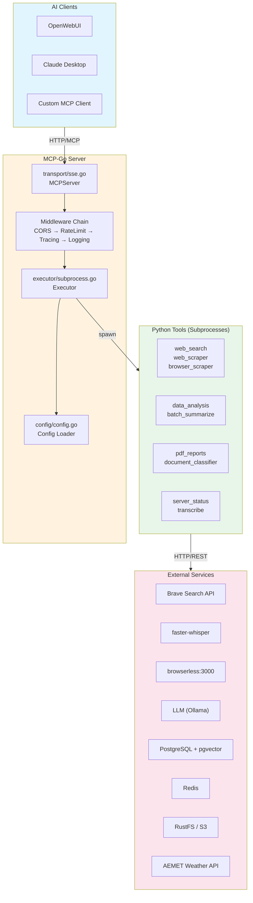
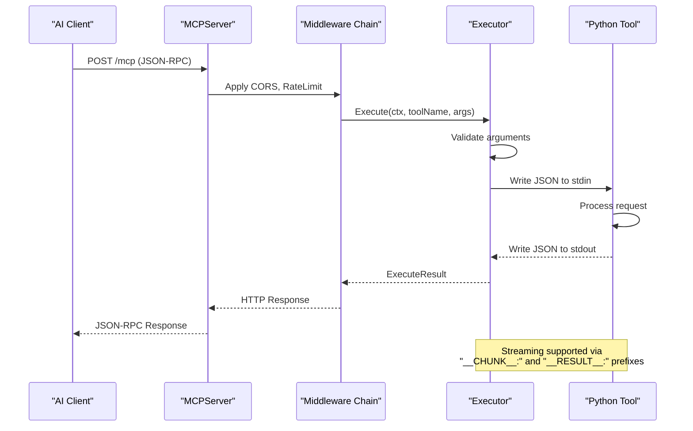
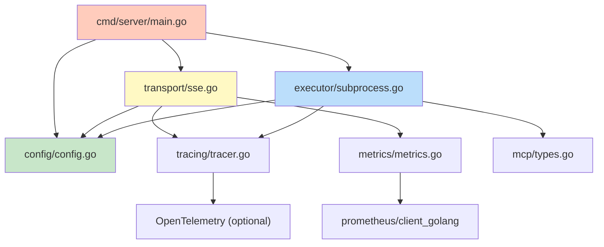
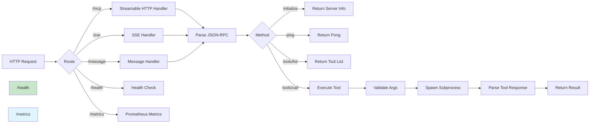
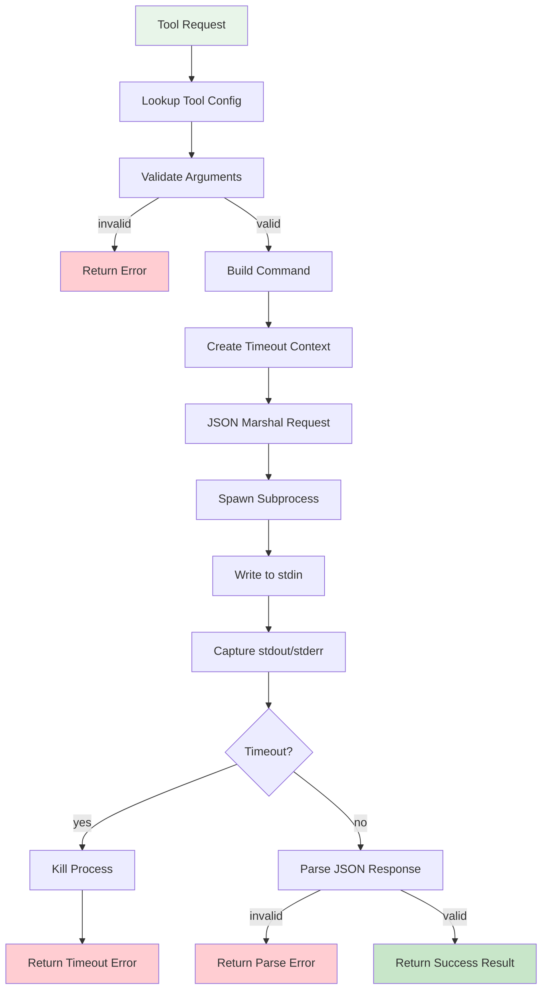
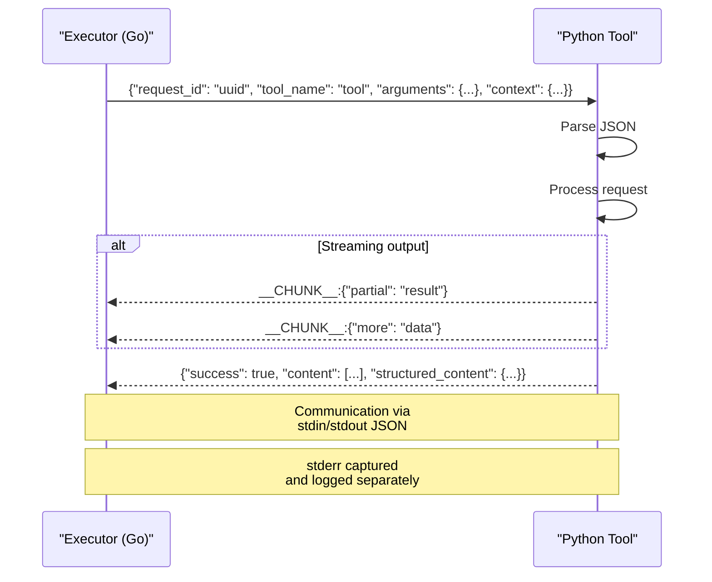
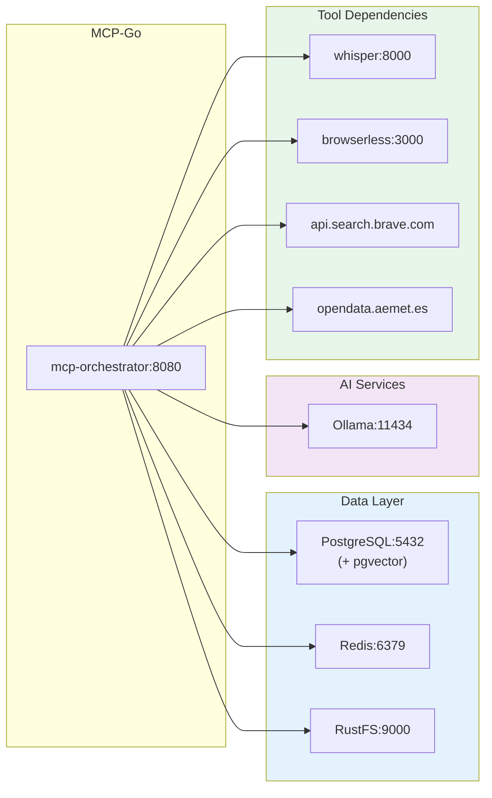
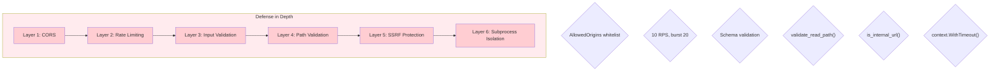
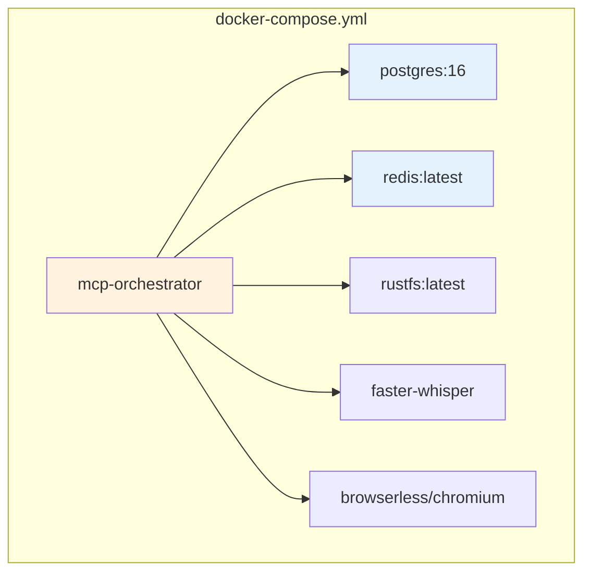

# MCP-Go Architecture Documentation

**Project**: MCP-Go Orchestrator Server  
**Version**: See `VERSION` file  
**Status**: Production Ready  
**Last Updated**: 2026-04-02

---

## Table of Contents

1. [Architecture Overview](#architecture-overview)
2. [System Components](#system-components)
3. [Component Diagrams](#component-diagrams)
4. [Request Flow](#request-flow)
5. [Data Flow](#data-flow)
6. [External Integrations](#external-integrations)
7. [Security Architecture](#security-architecture)
8. [Tool Protocol](#tool-protocol)

---

## Architecture Overview

MCP-Go is a **Model Context Protocol (MCP) Orchestrator Server** that acts as a bridge between AI clients and Python-based tool implementations. It implements the MCP protocol for tool orchestration while executing tools as isolated subprocesses.

### Core Responsibilities

| Responsibility | Description |
|----------------|-------------|
| **Protocol Handling** | Implements MCP Streamable HTTP (2025) and SSE (2024) transports |
| **Tool Execution** | Spawns and manages Python subprocesses for tool execution |
| **Configuration** | Loads and validates YAML configuration with environment variable expansion |
| **Observability** | Prometheus metrics, distributed tracing, structured logging |
| **Security** | Input validation, path traversal prevention, SSRF protection |

### Technology Stack

| Layer | Technology | Purpose |
|-------|-------------|---------|
| Server Core | Go 1.23+ | HTTP server, protocol handling, subprocess management |
| Transport | mcp-go library | MCP protocol implementation |
| Tools | Python 3.10+ | Tool implementations (18+ tools) |
| Configuration | YAML + gopkg.in/yaml.v3 | Type-safe config parsing |
| Metrics | Prometheus | Observability |
| Logging | zerolog | Structured JSON logging |

---

## System Components

### Go Internal Packages

```
internal/
├── config/           # Configuration management
│   ├── config.go     # Config structs, Load(), env var expansion
│   └── validation.go # Config validation helpers
├── executor/         # Tool execution engine
│   ├── subprocess.go # Subprocess spawning, timeout, streaming
│   ├── path_validator.go
│   └── llm_client.go
├── mcp/             # MCP protocol types
│   └── types.go     # SubprocessRequest, SubprocessResponse, ContentItem
├── health/          # Health check system
│   └── checks.go    # Redis, PostgreSQL, memory checks
├── metrics/          # Prometheus metrics
│   └── metrics.go    # Request counts, tool durations
├── transport/        # HTTP transport layer
│   ├── sse.go       # MCPServer, HTTP handlers
│   ├── cors.go      # CORS middleware
│   ├── ratelimit.go # Rate limiting middleware
│   ├── logging.go   # HTTP request logging
│   └── docs.go      # OpenAPI documentation
└── tracing/          # Distributed tracing
    └── tracer.go    # Span management
```

### Python Tools

| Tool | Purpose | Key Technologies |
|------|---------|------------------|
| `echo` | Testing/debugging | - |
| `data_analysis` | Excel/CSV analysis | Pandas, NumPy |
| `vision_ocr` | Image analysis | PIL, Tesseract |
| `pdf_reports` | Report generation | Jinja2, WeasyPrint |
| `knowledge_base` | Vector storage | pgvector, PostgreSQL |
| `batch_summarize` | Document summarization | LLM integration |
| `regulation_diff` | Document comparison | difflib |
| `config_auditor` | Security scanning | YAML/JSON parsing |
| `web_search` | Brave Search API | requests |
| `web_scraper` | HTML extraction | BeautifulSoup |
| `browser_scraper` | JS rendering | browserless/chromium |
| `transcribe` | Speech-to-text | faster-whisper |
| `server_status` | System monitoring | /proc filesystem |
| `rss_reader` | Feed parsing | feedparser |
| `weather` | AEMET integration | XML parsing |
| `canvas_diagram` | Diagram generation | Obsidian Canvas JSON |
| `rustfs_storage` | S3 operations | boto3 |

### Common Utilities

```
tools/common/
├── validators.py          # SSRF protection, path validation
├── sandbox.py           # Sandboxed code execution
├── safe_file_ops.py    # Secure file operations
├── retry.py            # LLM retry logic
└── structured_logging.py # JSON structured logging
```

---

## Component Diagrams

### System Architecture



### Request Flow



### Internal Package Dependencies



---

## Request Flow

### MCP Protocol Request Lifecycle



### Tool Execution Flow



---

## Data Flow

### Configuration Loading

```mermaid
flowchart TB
    A[YAML File] --> B[Read File]
    B --> C[Expand Env Vars]
    C --> D[yaml.Unmarshal]
    D --> E[Config Struct]
    E --> F{Validate}
    F -->|fail| G[Return Error]
    F -->|pass| H[Apply Defaults]
    H --> I[Expand Env in Map]
    I --> J[Final Config]
    J --> K[Set Tool Timeouts]

    Note over C: ${VAR} and<br/>${VAR:-default}
    Note over D: Type-safe via<br/>gopkg.in/yaml.v3
```

### Subprocess Communication



---

## External Integrations

### Service Dependency Graph



### Environment Variable Propagation

```mermaid
flowchart TB
    subgraph Docker["docker-compose.yml"]
        env["environment:"]
    end

    subgraph Config["configs/config.yaml"]
        yamlEnv["environment:"]
    end

    subgraph Executor["Executor"]
        toolEnv["Tool Environment"]
    end

    env --> yamlEnv
    yamlEnv -->|expand| toolEnv
    toolEnv -->|os.Environ| PythonTool

    Note over env,PythonTool: All vars expanded with<br/>${VAR:-default} syntax
```

---

## Security Architecture

### Security Layers



### SSRF Protection

The `is_internal_url()` function in `tools/common/validators.py` blocks:

| Category | Examples |
|----------|----------|
| Loopback | `127.0.0.1`, `::1`, `localhost` |
| Private Ranges | `10.x.x.x`, `172.16-31.x.x`, `192.168.x.x` |
| Link-local | `169.254.x.x`, `fe80:`, `fc00:`, `fd00:` |
| Cloud Metadata | `169.254.169.254`, `metadata.google.internal` |
| Reserved | `0.x`, `224.x+` (multicast) |

---

## Tool Protocol

### JSON Protocol

All tools communicate via JSON over stdin/stdout:

**Request (stdin):**
```json
{
  "request_id": "uuid-v4-string",
  "tool_name": "tool_name",
  "arguments": {
    "param1": "value1",
    "param2": "value2"
  },
  "context": {
    "llm_api_url": "http://ollama:11434",
    "llm_model": "llama3",
    "database_url": "postgresql://...",
    "working_dir": "/data"
  }
}
```

**Success Response (stdout):**
```json
{
  "success": true,
  "request_id": "uuid-v4-string",
  "content": [
    {"type": "text", "text": "Response text..."}
  ],
  "structured_content": {
    "key": "value"
  }
}
```

**Error Response (stdout):**
```json
{
  "success": false,
  "request_id": "uuid-v4-string",
  "error": {
    "code": "ERROR_CODE",
    "message": "Human-readable message"
  }
}
```

### Streaming Protocol

Tools can stream partial results using line prefixes:

```
__CHUNK__:{"partial": "result"}
__CHUNK__:{"more": "data"}
__RESULT__:{"success": true, "content": [...]}
```

---

## Configuration Schema

### Server Configuration

| Field | Type | Default | Description |
|-------|------|---------|-------------|
| `host` | string | `"0.0.0.0"` | Bind address |
| `port` | int | `8080` | TCP port |
| `name` | string | `"mcp-orchestrator"` | Service name |
| `base_url` | string | auto | Public URL for SSE |
| `rate_limit_rps` | float | `10` | Requests per second |
| `rate_limit_burst` | int | `20` | Burst size |
| `shutdown_timeout` | duration | `10s` | Graceful shutdown |
| `allowed_origins` | []string | `[]` (all) | CORS origins |

### Tool Configuration

| Field | Type | Required | Description |
|-------|------|----------|-------------|
| `name` | string | Yes | Unique identifier |
| `description` | string | Yes | For LLM consumption |
| `command` | string | Yes | Executable path |
| `args` | []string | No | Command arguments |
| `timeout` | duration | No | Execution timeout |
| `input_schema` | object | No | JSON Schema for validation |

---

## Monitoring & Observability

### Prometheus Metrics

| Metric | Type | Labels | Description |
|--------|------|--------|-------------|
| `mcp_requests_total` | Counter | method, status | Total HTTP requests |
| `mcp_request_duration_seconds` | Histogram | method, endpoint | Request latency |
| `mcp_tool_executions_total` | Counter | tool, status | Tool execution count |
| `mcp_tool_execution_duration_seconds` | Histogram | tool | Tool execution time |
| `mcp_llm_requests_total` | Counter | model, status | LLM API calls |
| `mcp_llm_request_duration_seconds` | Histogram | model | LLM response time |

### Health Checks

| Endpoint | Purpose |
|----------|---------|
| `GET /health` | Basic liveness check |
| `GET /health/detailed` | Component status |
| `GET /metrics` | Prometheus scrape |

---

## Deployment

### Docker Compose Services



### Resource Limits

| Service | CPU Limit | Memory Limit |
|---------|-----------|--------------|
| mcp-orchestrator | 2 cores | 3.5 GB |
| postgres | 2 cores | 2.5 GB |
| whisper | 2 cores | 2 GB |
| browserless | 1 core | 1 GB |
| rustfs | 1 core | 512 MB |

---

## Development

### Adding a New Tool

1. Create tool directory: `tools/<tool_name>/main.py`
2. Implement JSON stdin/stdout protocol
3. Add configuration to `configs/config.yaml`
4. Document in `USAGE.md`

### Testing

```bash
# Go tests
go test ./...

# Python security tests
python -m pytest tests/test_security_mitigations.py -v

# Integration tests
./tests/test_quick.sh
```

---

## Related Documentation

- [API Reference](docs/API.md) - Complete endpoint documentation
- [Development Guide](docs/DEVELOPMENT.md) - Developer setup and workflow
- [Security Hardening](SECURITY_HARDENING.md) - Security mitigations
- [Logging](docs/LOGGING.md) - Logging configuration
- [Usage Guide](USAGE.md) - Tool-specific usage examples
